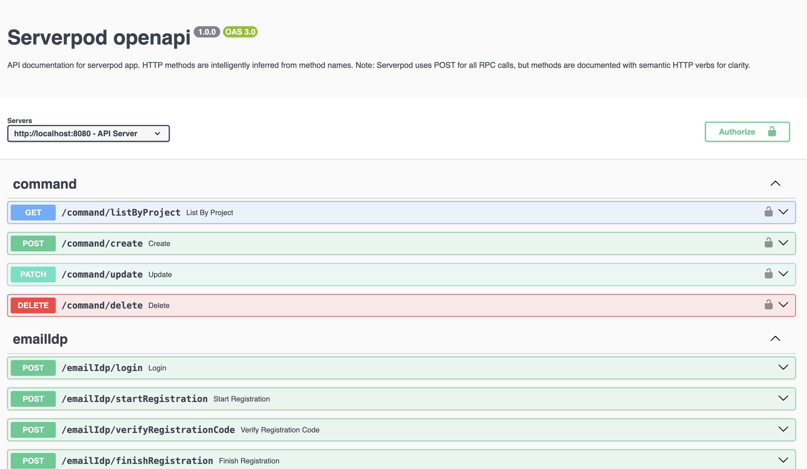
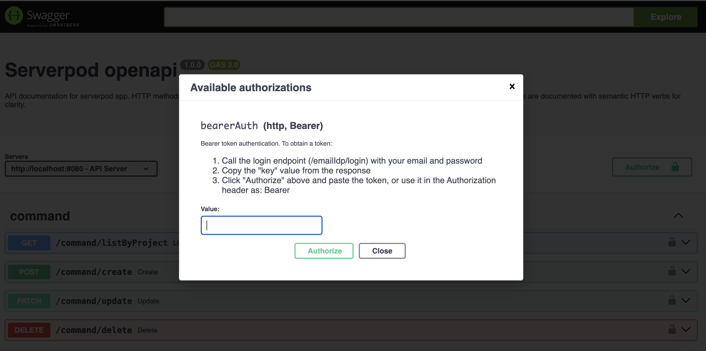
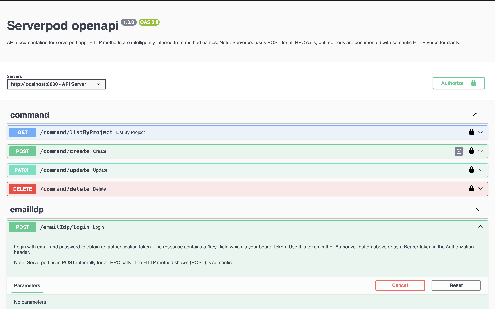

# serverpod_openapi

OpenAPI documentation for your Serverpod API with interactive Swagger UI.

The `serverpod_openapi` package automatically generates OpenAPI 3.0 specifications from your Serverpod endpoints and provides an interactive documentation interface. It intelligently infers HTTP methods from your endpoint method names and handles authentication requirements automatically.




## Features

- **Automatic API Documentation**: Generates OpenAPI specifications directly from your Serverpod endpoints
- **Interactive Swagger UI**: Browse and test your API endpoints through a beautiful web interface
- **Smart HTTP Method Inference**: Automatically determines appropriate HTTP methods from method names
- **Authentication Support**: Respects endpoint authentication requirements and provides token-based authentication in Swagger UI
- **Seamless Integration**: Works with any Serverpod project without additional configuration

## Installation

Add `serverpod_openapi` to your server's `pubspec.yaml`:

```yaml
dependencies:
  serverpod_openapi: ^0.0.1
```

Then run:

```bash
dart pub get
```

## Quick Start

Add the OpenAPI route to your `server.dart` file:

```dart
import 'package:serverpod/serverpod.dart';
import 'package:serverpod_openapi/serverpod_openapi.dart';
import 'package:your_server/src/generated/protocol.dart';
import 'package:your_server/src/generated/endpoints.dart';

void run(List<String> args) async {
  // Initialize Serverpod with your protocol and endpoints
  final pod = Serverpod(
    args,
    Protocol(),
    Endpoints(),
  );

  // Add OpenAPI documentation route
  pod.webServer.addRoute(
    RouteOpenApi(
      pod,
      title: 'My API',
      version: '1.0.0',
      description: 'API documentation for my Serverpod application.',
    ),
    '/openapi',
  );

  // Start the server
  await pod.start();
}
```

Once your server is running, visit `http://localhost:8082/openapi` to view your API documentation.

## Complete Example

Here's a complete example of a `server.dart` file with OpenAPI integration:

```dart
import 'package:serverpod/serverpod.dart';
import 'package:serverpod_openapi/serverpod_openapi.dart';
import 'package:your_server/src/generated/protocol.dart';
import 'package:your_server/src/generated/endpoints.dart';

void run(List<String> args) async {
  // Initialize Serverpod
  final pod = Serverpod(
    args,
    Protocol(),
    Endpoints(),
  );

  // Add OpenAPI documentation route
  // This will be available at http://localhost:8082/openapi
  pod.webServer.addRoute(
    RouteOpenApi(
      pod,
      title: 'E-Commerce API',
      version: '1.0.0',
      description: 'Complete API for managing products, orders, and customers.',
    ),
    '/openapi',
  );

  // Optional: Add additional routes or middleware here
  // pod.webServer.addRoute(...);

  // Start the server
  await pod.start();
}
```

### Example Endpoints

With the following endpoints defined in your Serverpod project:

```dart
// lib/src/endpoints/user_endpoint.dart
class UserEndpoint extends Endpoint {
  // GET operation - inferred from 'list' prefix
  Future<List<User>> listUsers(Session session) async {
    // Returns a list of users
  }

  // GET operation - inferred from 'get' prefix
  Future<User?> getUser(Session session, int id) async {
    // Returns a specific user
  }

  // POST operation - inferred from 'create' prefix
  Future<User> createUser(
    Session session,
    String name,
    String email,
  ) async {
    // Creates a new user
  }

  // PATCH operation - inferred from 'update' prefix
  Future<User> updateUser(
    Session session,
    int id,
    String? name,
  ) async {
    // Updates an existing user
  }

  // DELETE operation - inferred from 'delete' prefix
  Future<void> deleteUser(Session session, int id) async {
    // Deletes a user
  }
}

// lib/src/endpoints/product_endpoint.dart
class ProductEndpoint extends Endpoint {
  // GET operation
  Future<List<Product>> listProducts(Session session) async {
    // Returns a list of products
  }

  // POST operation
  Future<Product> createProduct(
    Session session,
    String name,
    double price,
    int stock,
  ) async {
    // Creates a new product
  }
}
```

The OpenAPI documentation will automatically show:

- `GET /user/listUsers` - List all users
- `GET /user/getUser` - Get a specific user (requires `id` parameter)
- `POST /user/createUser` - Create a new user (requires `name` and `email`)
- `PATCH /user/updateUser` - Update a user (requires `id`, optional `name`)
- `DELETE /user/deleteUser` - Delete a user (requires `id`)
- `GET /product/listProducts` - List all products
- `POST /product/createProduct` - Create a new product (requires `name`, `price`, `stock`)

All endpoints will be automatically documented with their parameters, request/response schemas, and authentication requirements.

## Configuration

The `RouteOpenApi` constructor accepts the following parameters:

- `pod` (required): Your Serverpod instance
- `title` (optional): The API title displayed in the documentation (default: `'API Documentation'`)
- `version` (optional): The API version (default: `'1.0.0'`)
- `description` (optional): A description of your API

### Example with Custom Configuration

```dart
pod.webServer.addRoute(
  RouteOpenApi(
    pod,
    title: 'E-Commerce API',
    version: '2.1.0',
    description: 'Complete API for managing products, orders, and customers.',
  ),
  '/api-docs',  // Custom path
);
```

## Accessing Documentation

After adding the route, you can access your API documentation in several ways:

- **Swagger UI** (default): `http://localhost:8082/openapi`
- **JSON format**: `http://localhost:8082/openapi?format=json`
- **YAML format**: `http://localhost:8082/openapi?format=yaml`

## How It Works

### HTTP Method Inference

The package automatically infers HTTP methods from your endpoint method names using common naming conventions:

**GET** methods (read operations):

- `get*`, `list*`, `fetch*`, `find*`, `read*`, `retrieve*`, `query*`, `search*`, `show*`, `view*`, `load*`

**POST** methods (create operations):

- `create*`, `add*`, `insert*`, `save*`, `register*`, `new*`, `build*`, `generate*`, `submit*`, `send*`, `post*`
- Action methods: `execute*`, `run*`, `perform*`, `do*`, `trigger*`, `invoke*`, `call*`, `start*`, `stop*`, `login*`, `logout*`

**PATCH** methods (update operations):

- `update*`, `modify*`, `patch*`, `edit*`, `change*`, `set*`, `put*`, `replace*`, `adjust*`

**DELETE** methods (delete operations):

- `delete*`, `remove*`, `destroy*`, `drop*`, `clear*`, `unlink*`, `unregister*`

If a method name doesn't match any pattern, it defaults to POST (since Serverpod uses POST internally for all RPC calls).

### Authentication

The package automatically:

- Detects which endpoints require authentication based on the `requireLogin` property
- Excludes authentication endpoints (login, register, etc.) from requiring authentication
- Adds Bearer token authentication to protected endpoints
- Provides clear instructions for obtaining and using authentication tokens

When you use the login endpoint through Swagger UI, the response includes a `key` field. This is your bearer token. Click the "Authorize" button in Swagger UI and paste the token to authenticate subsequent requests.

### Request Transformation

Serverpod uses a POST-based RPC structure internally. The package automatically transforms Swagger UI requests to match this structure:

- Paths like `/endpointName/methodName` are converted to `/endpointName`
- All HTTP methods are converted to POST (as required by Serverpod)
- The method name and parameters are included in the request body

This transformation happens transparently, so you can use the REST-like interface in Swagger UI while the actual requests match Serverpod's RPC structure.

## Example

Consider a Serverpod endpoint:

```dart
class UserEndpoint extends Endpoint {
  Future<List<User>> listUsers(Session session) async {
    // Returns a list of users
  }

  Future<User> createUser(Session session, String name, String email) async {
    // Creates a new user
  }

  Future<User> updateUser(Session session, int id, String name) async {
    // Updates an existing user
  }

  Future<void> deleteUser(Session session, int id) async {
    // Deletes a user
  }
}
```

The OpenAPI documentation will show:

- `GET /user/listUsers` - for listing users
- `POST /user/createUser` - for creating users (with `name` and `email` parameters)
- `PATCH /user/updateUser` - for updating users (with `id` and `name` parameters)
- `DELETE /user/deleteUser` - for deleting users (with `id` parameter)

When you test these endpoints in Swagger UI, the requests are automatically transformed to:

- `POST /user` with `{"method": "listUsers"}` in the body
- `POST /user` with `{"method": "createUser", "name": "...", "email": "..."}` in the body
- `POST /user` with `{"method": "updateUser", "id": 1, "name": "..."}` in the body
- `POST /user` with `{"method": "deleteUser", "id": 1}` in the body

## Type Support

The package automatically maps common Dart types to OpenAPI schema types:

- `int` → `integer` (int64)
- `double` → `number` (double)
- `String` → `string`
- `bool` → `boolean`
- `DateTime` → `string` (date-time format)
- `UuidValue` → `string` (uuid format)
- `List<T>` → `array`
- `Map` → `object`
- Custom types → `object` with type description

Nullable types are properly handled with `oneOf` schemas.

## Best Practices

1. **Use descriptive method names**: The HTTP method inference relies on clear naming conventions. Use prefixes like `get`, `create`, `update`, `delete` for best results.

2. **Document your endpoints**: Add meaningful descriptions to your endpoint classes and methods. While the package generates documentation automatically, additional context helps API consumers.

3. **Secure your documentation**: In production, consider restricting access to the OpenAPI route or moving it to a separate path that's not publicly accessible.

4. **Version your API**: Update the version parameter when making breaking changes to help API consumers understand compatibility.

## Limitations

- The package depends on Serverpod's internal structure. If Serverpod introduces breaking changes to its API, this package will need to be updated to maintain compatibility.
